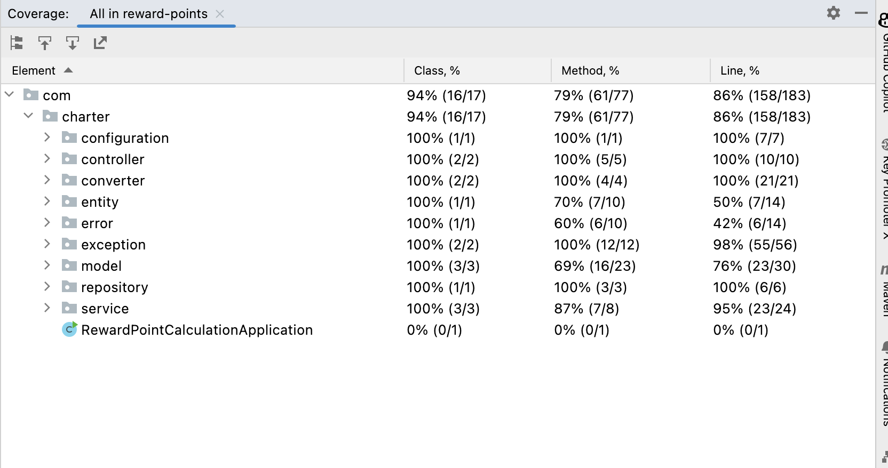

# Reward Points Calculation App
## Introduction

The app calculates reward points(last 3 months grouped by month) for a given customer
and provides total reward points for last 3 month.

Business Requirement :

A customer receives 2 points for every dollar spent over $100 in each transaction, plus 1 point for every dollar spent between $50 and $100 in each transaction.
(e.g. a $120 purchase = 2x$20 + 1x$50 = 90 points).

## Build Application

1) Clone the project : https://github.com/dileep-thomas-ig/reward-points.git
2) Run mvn clean install.

3) Run below command to start the application
   >java -jar rewards-calculator-0.0.1-SNAPSHOT.jar

## End points

### Get customer total reward points

Description : This API fetches last 3 months(from current date) reward points,grouped by each month and 
also total reward points for last 3 months.

1) Endpoint URL: localhost:8080/rewards/points/{customerID}
2) HTTP method: GET
3) Response code: 200
4) Sample response: 

   {
   "rewards": [
   {
   "purchaseDate": "2023-02-03",
   "amount": 1000.00,
   "rewardPoints": 1850.00
   },
   {
   "purchaseDate": "2023-01-03",
   "amount": 500.00,
   "rewardPoints": 850.00
   },
   {
   "purchaseDate": "2022-12-03",
   "amount": 600.50,
   "rewardPoints": 1051.00
   }
   ],
   "totalRewardPoints": 3751.00
   }

### Save customer transaction data

1) Endpoint URL: localhost:8080/transaction/create
2) HTTP method: POST
3) Response code: 201
4) Sample Request:

   {
   "customerId" : 1,
   "amount" : 500,
   "purchaseDate" : "2022-12-03"
   }

### Code coverage
